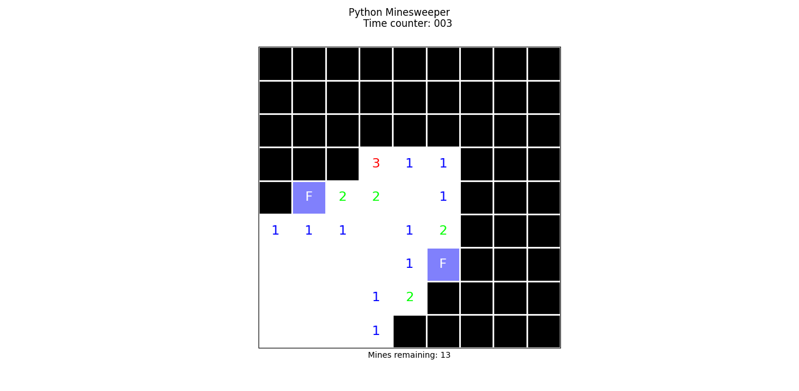
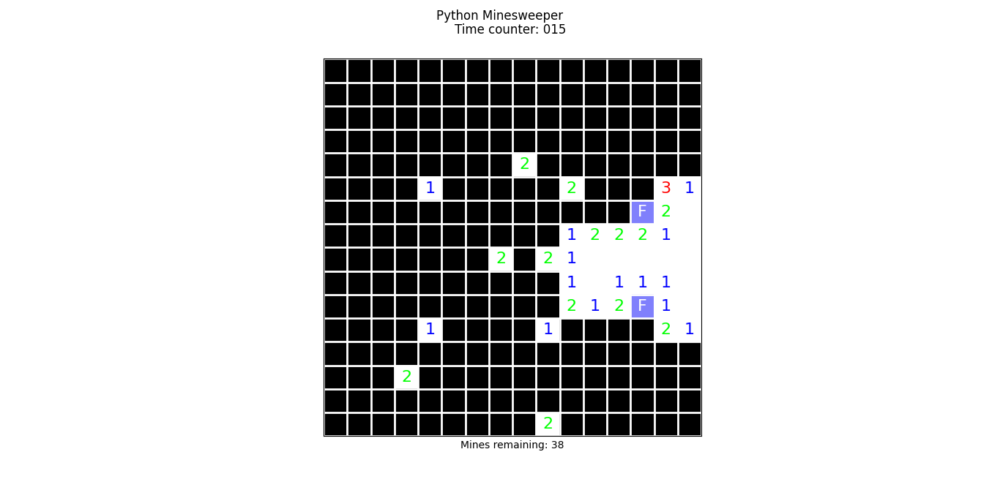
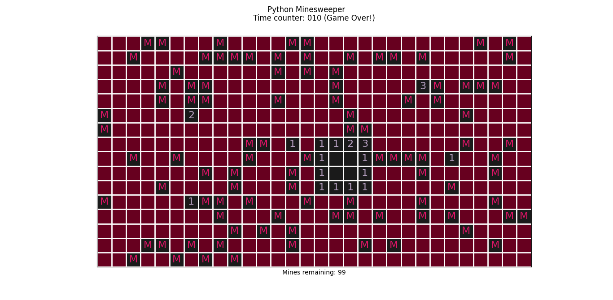

# Minesweeper in Python

This is a simple implementation of Minesweeper fully in Python.




# Requirements
Python 3.8+

# Installation
```
git clone https://github.com/FelSiq/minesweepyr.git
pip install -Ur requirements.txt
```

# Run
```
python minesweepyr.py (basic|medium|expert)
```

# Commands
Standard minesweeper commands:
- **Left click:** open tile;
- **Right click:** switch mark in tile; and
- **Both/middle button:** open all tiles in the neighborhood of target tile.

# License
MIT.
